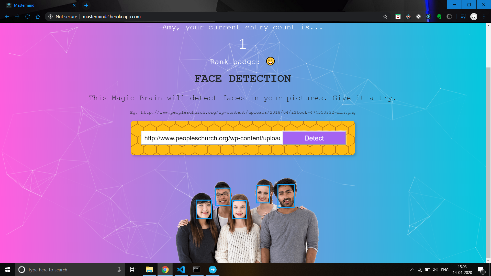
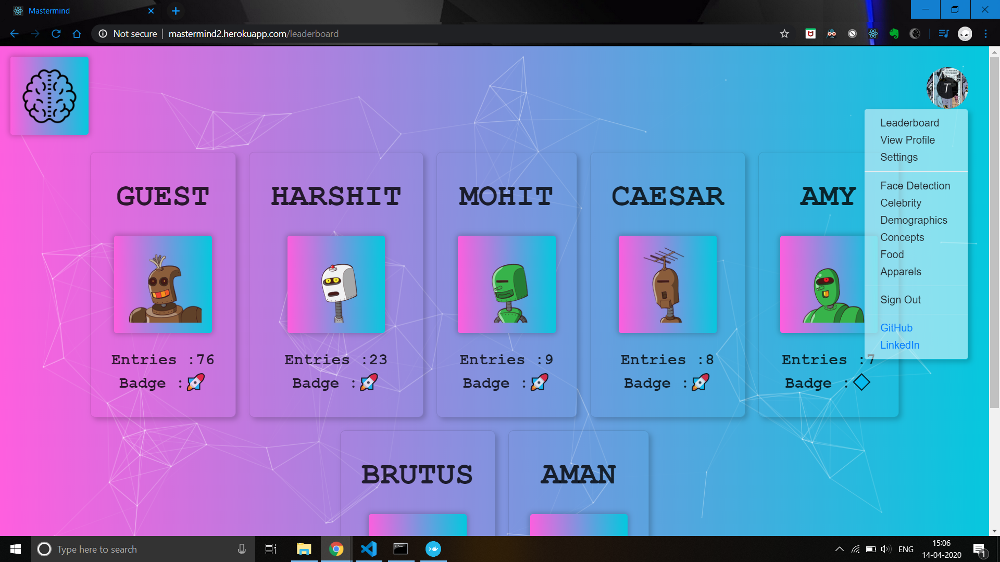
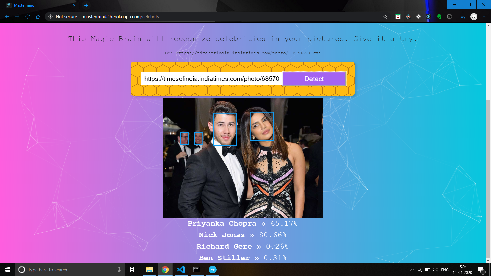
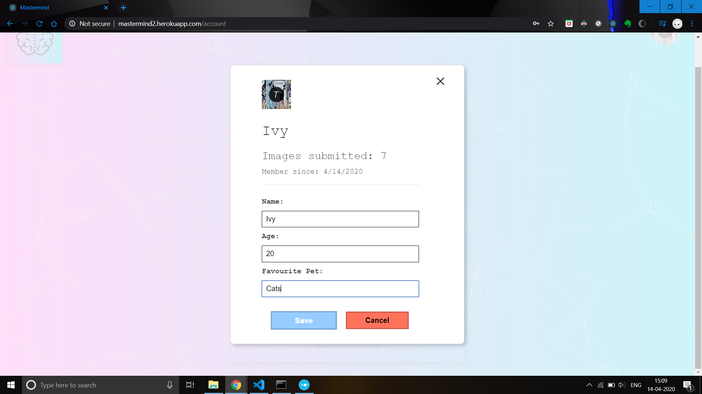

# Mastermind v2 (Frontend)

> This is a web application which uses machine learning to provide various analytics on images with provisions for registering, signing in, viewing the leaderboard and editing profiles. You can detect faces, get demographics, recognize celebrities, concepts, food and apparels in your images. 

> This repository hosts the code for the frontend. Code for the backend part can be found at https://github.com/hmahajan99/Mastermind-v2-Backend

> For the previous version of this app, Mastermind v1 see https://github.com/hmahajan99/Mastermind.

> Deployed at https://mastermind2.herokuapp.com/

## This project consists of :
<ul>
<li><b>Image Analyzer: </b>Using Clarifai API
  <ul>
    <li>Face Detection</li>
    <li>Demographics</li>
    <li>Recognize celebrities</li>
    <li>Recognize geeneral concepts</li>
    <li>Recognize food</li>
    <li>Recognize apparel</li>
  </ul>
</li>
<li><b>Frontend: </b>Built using React</li>
<li><b>Server: </b>Built using Express framework</li>
<li><b>Database: </b>PostgreSQL, for storing user data</li>
<li><b>User Authentication and Session Management: </b>Using Redis and JSON Web Tokens</li>
<li><b>Docker: </b>Used during development to run containers for postgres,redis and the server</li>
</ul>

To run this project :
1. Clone this repo
2. Change your directory : `cd Mastermind2-frontend`
3. Run `npm install`
4. Set up environment variable REACT_APP_BACKEND_URL  
5. Run `npm run dev`

#### Face Detection :

#### Leaderboard :

#### Recognize Celebrities :

#### User Profile :

