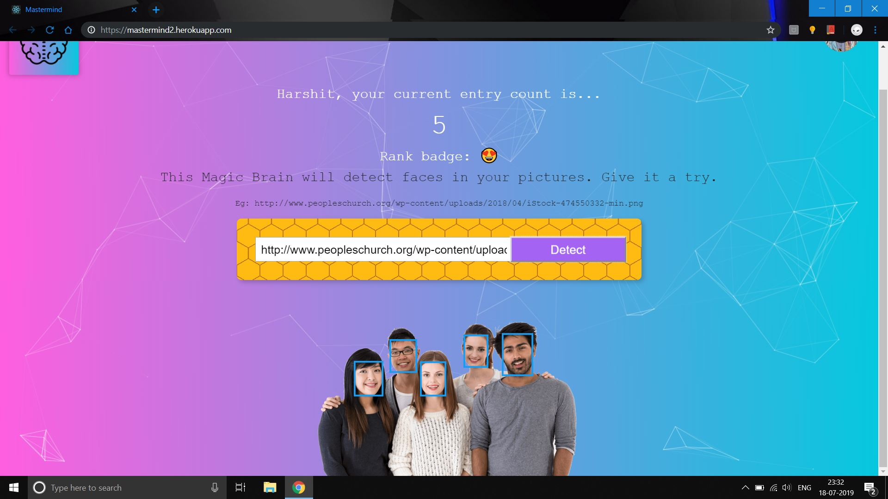
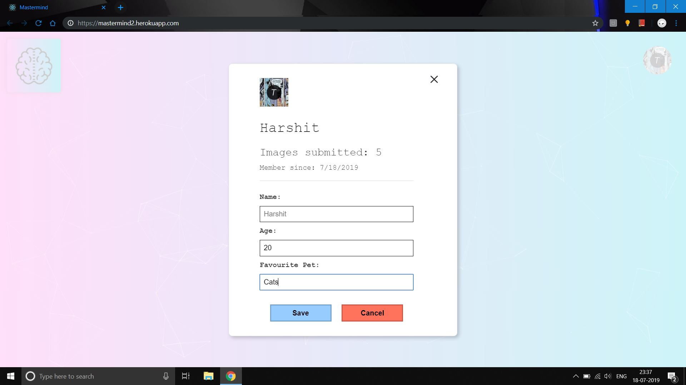
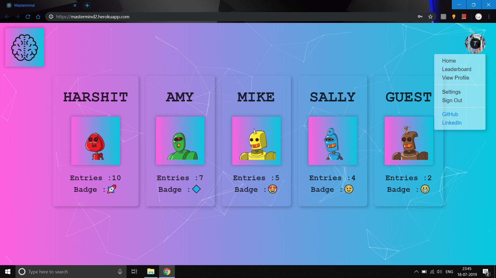

# Mastermind 2.0 (Frontend)

> This is a web application which uses machine learning to detect faces in your images with provisions for registering, signing in, viewing the leaderboard and editing profiles.

> This repository hosts the code for the frontend. Code for the backend part can be found at https://github.com/hmahajan99/Mastermind2-backend.
For the previous version of this app, Mastermind 1.0 see https://github.com/hmahajan99/Mastermind.

> Deployed at https://mastermind2.herokuapp.com/

## This project consists of :
<ul>
<li><b>Face Detection: </b>Using Clarifai API</li>
<li><b>Frontend: </b>Built using React</li>
<li><b>Server: </b>Built using Express framework</li>
<li><b>Database: </b>PostgreSQL, for storing user data</li>
<li><b>User Authentication and Session Management: </b>Using Redis and JSON Web Tokens</li>
<li><b>Docker: </b>Used during development to run containers for postgres,redis and the server</li>
</ul>

To run this project :
1. Clone this repo
2. Change your directory : `cd Mastermind2-frontend`
3. Run `npm install`
4. Set up environment variable REACT_APP_BACKEND_URL  
5. Run `npm run dev`

#### Face Detection :

#### User Profile :

#### Leaderboard :

